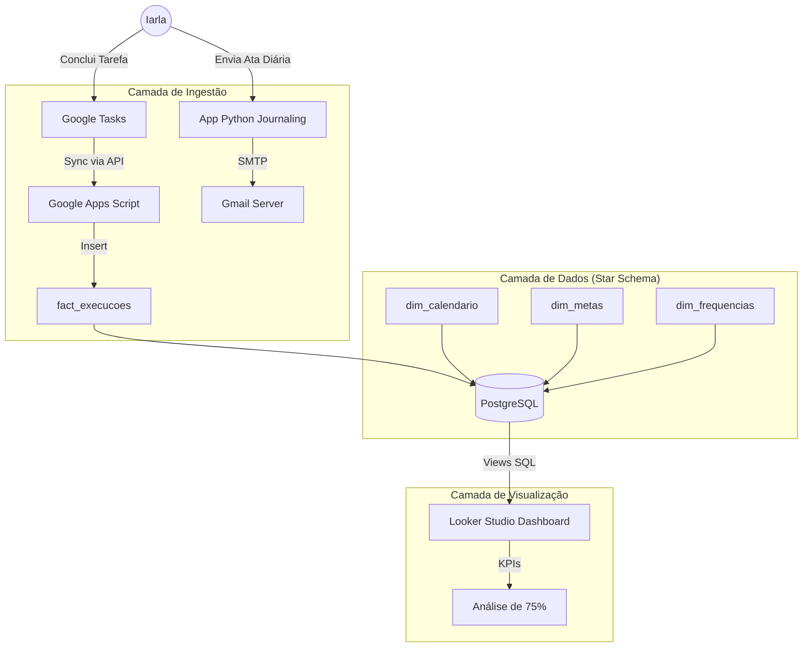

# BeePlanner

##  Life Engineering 2026: Roda da Vida & Tracker

> "O que não é medido não é gerenciado." — W. Edwards Deming

Este repositório contém a suíte de engenharia de dados pessoal projetada para monitorar, registrar e analisar o progresso de metas anuais baseadas na metodologia "Roda da Vida". O objetivo principal é garantir uma aderência de **75%** nas metas definidas para o ano de 2026.

## 🏗 Arquitetura do Sistema

O projeto opera em três camadas principais: **Planejamento (Database)**, **Execução (Ingestão)** e **Registro (Journaling)**.



---

## 📂 Estrutura do Projeto

```text
/
├── database/                   # Modelagem SQL (Star Schema)
│   ├── ddl/                    # Criação de tabelas (dim_metas, fact_execucoes, etc.)
│   ├── views/                  # Views de cálculo (vw_dashboard_final)
│   └── seeds/                  # Carga inicial (Frequências e Categorias)
│
├── scripts/
│   ├── etl_calendario/         # Geração da dimensão de tempo
│   │   ├── generate_calendar.py
│   │   └── calc_metas_2026.py
│   │
│   ├── google_automation/      # Integração com Google Workspace
│   │   └── tasks_sync.gs       # Apps Script (Tasks -> DB)
│   │
│   └── daily_ops/              # Ferramentas de uso diário (Novas Funcionalidades)
│       ├── agenda_email.py     # GUI para envio de Ata Diária
│       └── gerar_data_padrao.py # Lib de formatação de data/hora local
│
└── docs/                       # Documentação e Blueprints
    └── dashboard_blueprint.md

```

---

## 🚀 Funcionalidades

### 1. Motor de Metas (Core)

Monitoramento baseado em dados reais vs. expectativa de calendário.

* **Cálculo Dinâmico:** Scripts Python calculam exatamente quantos dias uma meta deve ocorrer em 2026 (ex: "Podcast às Terças e Quintas" = 105 ocorrências).
* **Regra dos 75%:** KPIs automáticos que indicam se o progresso atual garante a aprovação anual.

### 2. Automação de Tarefas (Google Tasks)

Script `Google Apps Script` que roda diariamente para capturar tarefas concluídas ("Check-ins") e persistir no banco de dados analítico.

### 3. Diário de Bordo / Ata (Python App) 🆕

Ferramenta desktop desenvolvida em Python (`Tkinter`) para formalizar o encerramento do dia.

* **Feature:** Envio de e-mail formatado via SMTP (Gmail).
* **Padronização:** Assunto automático com o "Dia do Ano" (ex: *Ata do dia 45*), facilitando a busca futura.
* **Logs:** Gera timestamps detalhados com locale `pt_BR`.

---

## 🛠 Instalação e Configuração

### Pré-requisitos

* Python 3.10+
* PostgreSQL (Local ou Cloud)
* Conta Google (Para Tasks API e App Password do Gmail)

### 1. Configuração do Banco de Dados

Execute os scripts na ordem:

1. `database/ddl/*.sql` (Criação das tabelas)
2. `database/seeds/initial_data.sql` (Popula frequências e categorias)
3. Importe o CSV gerado por `calc_metas_2026.py` para a tabela `dim_metas`.

### 2. Configuração do App de Diário (Daily Ops)

As ferramentas de envio de email localizadas em `scripts/daily_ops/`:

1. Edite o arquivo `agenda_email.py` com suas credenciais de App (ou configure variáveis de ambiente):
```python
EMAIL_REMETENTE = "seu_email@gmail.com"
EMAIL_SENHA = "sua_senha_de_app" # NÃO use sua senha real, gere uma App Password

```


2. Instale dependências (se necessário):
O script utiliza bibliotecas nativas (`tkinter`, `smtplib`, `datetime`, `locale`).
3. Execução:
```bash
python scripts/daily_ops/agenda_email.py

```


*Isso abrirá uma interface gráfica para digitar o resumo do dia e enviar para o email cadastrado.*

### 3. Utilitário de Data (`gerar_data_padrao.py`)

Módulo auxiliar que formata datas no padrão brasileiro com metadados de engenharia (Dia do Ano, Semana ISO).

* **Output:** `Dia 045, Semana 07 - Sexta-feira, 14 de Fevereiro de 2026`
* Utilizado para cabeçalhos de logs e assuntos de email.

---

## 📊 Visualização (Looker Studio)

O Dashboard consome a view `vw_dashboard_final` e apresenta:

1. **Radar Chart:** Equilíbrio da Roda da Vida.
2. **Gauges:** Progresso individual por meta (Alvo: 75%).
3. **Status:** Indicadores booleanos (✅ SUCESSO / ⚠️ ATENÇÃO).

---

## 📝 Autora

**Iarla** - *Engenheira de Software*
Projeto pessoal para gestão de alta performance e tracking de hábitos.
